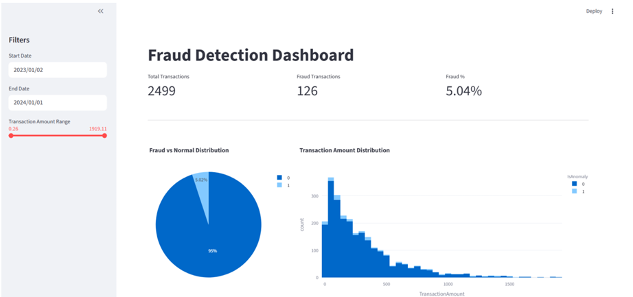
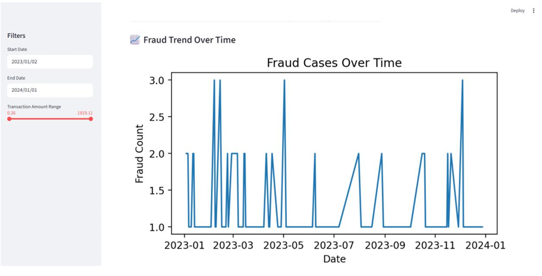
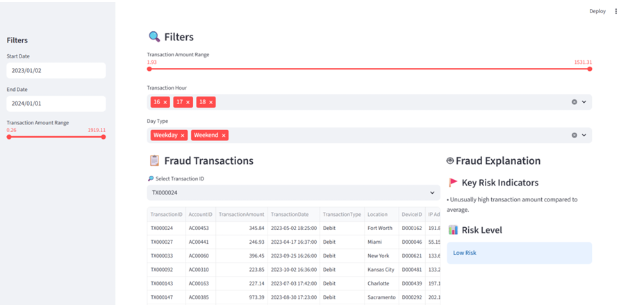

# AI-Powered Fraud Detection Dashboard

## Project Overview

This project presents an end-to-end Fraud Detection System designed to identify suspicious banking transactions using unsupervised machine learning.

The solution combines:

* Feature Engineering
* Anomaly Detection
* Interactive Analytics
* Explainable AI
* Streamlit Dashboard

The primary objective is to detect potentially fraudulent transactions and provide investigators with actionable insights through an intuitive monitoring interface.

---

## Business Problem

Financial institutions process millions of transactions daily, making manual fraud detection impractical.

Traditional rule-based systems often struggle to identify evolving fraud patterns.

This project aims to:

* Detect suspicious transactions automatically.
* Identify anomalies in customer behavior.
* Support fraud investigators with interpretable explanations.
* Monitor fraud trends through interactive visualizations.

---

## Tools & Technologies

* Python
* Streamlit
* Pandas
* NumPy
* Scikit-Learn
* Isolation Forest
* Matplotlib
* Plotly

---

## System Architecture

### Data Processing

Raw transaction data was enriched using behavioral, temporal, and financial features.

### Time-Based Features

* Transaction Gap Minutes
* Transaction Hour
* Weekday Analysis
* Weekend Indicators
* First Transaction Flag

### Behavioral Features

* Amount-to-Balance Ratio
* Debit Amount Ratio
* Credit Amount Ratio

### Risk Indicators

* High Login Attempts
* Long Transaction Duration Flag

These engineered features help identify unusual transaction behavior that may indicate fraud.

---

## Machine Learning Model

### Isolation Forest

Fraud detection is a highly imbalanced problem where fraudulent transactions are relatively rare.

Isolation Forest was selected because:

* It works without labeled fraud data.
* It is effective for anomaly detection.
* It performs well on high-dimensional feature spaces.
* It isolates anomalous observations efficiently.

### Prediction Logic

* `-1` → Fraudulent / Anomalous Transaction
* `1` → Normal Transaction

Predictions are converted into a binary fraud flag for further analysis.

---

## Dashboard Features

### Global Filters

Users can dynamically filter transactions using:

* Date Range
* Transaction Amount Range

### Key Performance Indicators

The dashboard displays:

* Total Transactions
* Total Fraud Transactions
* Fraud Percentage

### Visual Analytics

Interactive visualizations include:

* Fraud vs Normal Transaction Distribution
* Transaction Amount Distribution
* Fraud Trend Analysis Over Time

These views help identify suspicious patterns and fraud spikes.

---

## Explainable AI Layer

One challenge of Isolation Forest is the lack of transaction-level explanations.

To improve interpretability, a rule-based explainability layer was developed.

The system evaluates:

* Unusually High Transaction Amounts
* Suspicious Transaction Hours
* Weekend Behavioral Deviations
* Age-Based Behavioral Anomalies

Each condition contributes to a cumulative risk score.

Transactions are categorized as:

* High Risk
* Medium Risk
* Low Risk

This approach provides transparency and helps investigators understand why a transaction was flagged.

---

## Fraud Investigation Workflow

The dashboard enables transaction-level investigation.

### Investigation Process

1. Filter anomalous transactions.
2. Select a transaction ID.
3. Review transaction details.
4. Generate contextual fraud explanations.
5. Assess risk level.

This workflow simulates a real-world fraud monitoring environment.

---

## Key Business Benefits

* Early Fraud Detection
* Reduced Financial Losses
* Improved Fraud Investigation Efficiency
* Better Risk Monitoring
* Enhanced Transaction Transparency

---

## End-to-End Workflow

1. Load transaction data
2. Engineer behavioral features
3. Scale numerical features
4. Apply Isolation Forest model
5. Generate anomaly predictions
6. Create fraud labels
7. Visualize fraud trends
8. Generate transaction explanations
9. Support fraud investigations

---

## Conclusion

This project demonstrates a practical fraud detection solution using unsupervised machine learning.

By combining feature engineering, anomaly detection, interactive analytics, and explainability techniques, the system provides a scalable framework for identifying suspicious banking transactions and supporting fraud investigation workflows.

---

## Skills Demonstrated

* Machine Learning
* Anomaly Detection
* Isolation Forest
* Feature Engineering
* Explainable AI
* Streamlit Development
* Fraud Analytics
* Fintech Analytics
* Data Visualization

---

## Author

**Kriti Singh**

